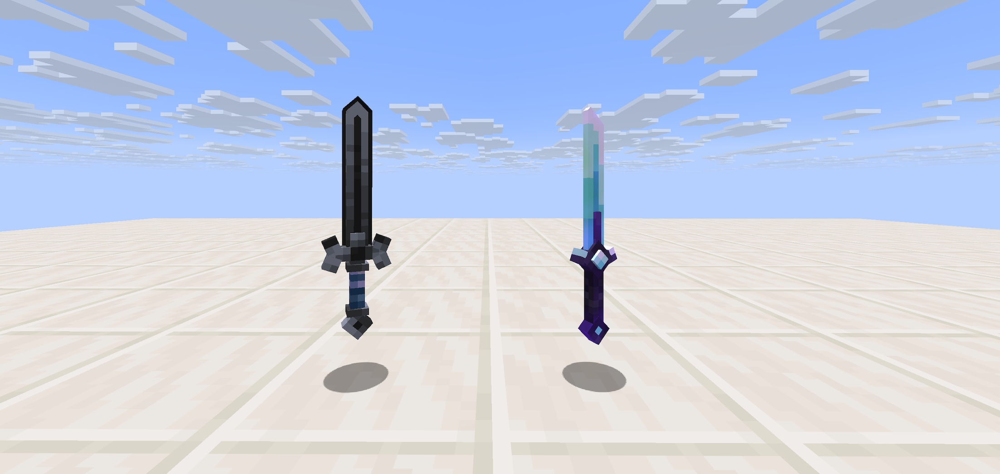

# Fallout Legendary Weapons

This is a work-in-progress standalone legendary weapons pack for Fallout SMP, a private invite-only Minecraft server, inspired by the legendary weapons from Altar SMP and Hoplite.

## Weapons

- **Pale Blade**: Combo-focused sword. All attacks (including missed ones) do stacking sweeping damage.
- **The Descent**: A mace-inspired sword. Smash attacks deal damage-capped AOE damage, and teleports the user back upwards (instead of wind burst launching upwards).
- **Dragon Egg**: The Dragon Egg gives its holder near permanent buffs, including extra health, strength, etc, but permanent glowing.

## Features

- **Legendary Weapons Framework**: Framework for legendary weapons, including loot tables and (planned) altar crafting recipes.
- **Particles**: Flashy, but fitting all-vanilla particle effects for weapon attacks / special attacks.

## Resource Pack

Weapon models and textures live separately on the `feature/resource-pack` branch as a resource-pack zip.
